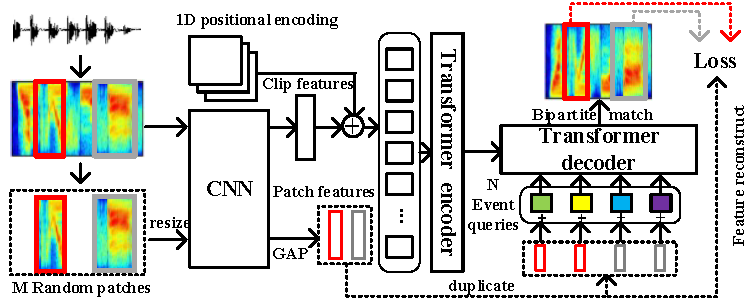

# Sound Event Detection Transformer

## Prepare your data
+ URBANSED Dataset  
  Download [URBAN-SED_v2.0.0](https://zenodo.org/record/1324404/files/URBAN-SED_v2.0.0.tar.gz?download=1) dataset, and 
  change $urbansed_dir in config.py to your own URBAN-SED data path. To generate *.tsv file, run
    ```python
    python ./data_utils/collapse_event.py
    ```

 
+ DCASE2019 Task4 Dataset  
Download the dataset from the website of [DCASE](http://dcase.community/), and change $dcase_dir in config.py to your own
 DCASE data path. 

## Train models
+ To train model on the dataset of URBANSED, run
    ```shell script
    python train_sedt.py
              --gpus $ngpu
              --batch_size 64
              --fusion_strategy 1 
              --dec_at 
              --weak_loss_coef 3
              --epochs 400 # total epochs
              --epochs_ls 280 # epochs of learning stage
              --lr_drop 160
    ```

## Evaluate models
+ For URBAN-SED dataset, download our [SEDT(E=3, Eb_F1=38.15)](https://drive.google.com/file/d/1X7PEZzPH61W1KCFAyLN6RspvIfabb2H-/view?usp=sharing), put it in ./exp/urbansed/model/ , then run
     ```shell script
    python train_sedt.py --gpus 0 --dec_at --fusion_strategy 1 --eval --info URBAN-SED
    ```

# SP-SEDT: Self-supervised Pretraining  for SEDT 

## Prepare your data
+ DCASE2018 Task5 development dataset  
  Download [the dataset](https://zenodo.org/record/1247102), put the audios in $dcase_dir/audio/train/ and the *.tsv file
   in $dcase_dir/metadata/train/
## Train models
+ To pretrain SEDT, download our [backbone](https://drive.google.com/file/d/1R-hAnM6cW1Q9TvLBqROrTxOp4T99Ih76/view?usp=sharing) 
which has been trained by audio tagging task (we will add this process soon), then run
```shell script
python train_sedt.py  --gpus 0 --dataname dcase --num_patches 10 --enc_layers 6 --epochs 160 --pretrain "backbone" --checkpoint_epochs 20 --self_sup 
```
You can also download our [pretrained model](https://drive.google.com/file/d/1iYykmwu0Imuoypb30IQDRWIf-_3F7mXu/view?usp=sharing),
and put it in ./exp/dcase/model/
+ To fine-tune SEDT, run
```shell script
python train_sedt.py --gpus 0 --batch_size 32 --n_weak 16 --dataname dcase --enc_layers 6 --dec_at --fusion_strategy 1 2 3 --epochs 300 --pretrain "Pretrained_SP_SEDT" --weak_loss_coef 0.25
```
## Evaluate models  
  Download our [SP-SEDT(E=6, Eb_F1=39.03)](https://drive.google.com/file/d/1JIhvRpvW6MC7N88PxCVQ8BpckaAYLDDU/view?usp=sharing), put it in ./exp/dcase/model/ , then run
  ```shell script
python train_sedt.py --gpus 0 --dataname dcase --enc_layers 6 --dec_at --fusion_strategy 1 --eval --info SP_SEDT
```
## Related papers
```
@article{2021Sound,
  title={Sound Event Detection Transformer: An Event-based End-to-End Model for Sound Event Detection},
  author={ Ye, Zhirong  and  Wang, Xiangdong  and  Liu, Hong  and  Qian, Yueliang  and  Tao, Rui  and  Yan, Long  and  Ouchi, Kazushige },
  year={2021},
}
@article{2021SP,
  title={SP-SEDT: Self-supervised Pre-training for Sound Event Detection Transformer},
  author={ Ye, Z.  and  Wang, X.  and  Liu, H.  and  Qian, Y.  and  Tao, R.  and  Yan, L.  and  Ouchi, K. },
  journal={arXiv e-prints},
  year={2021},
}
```
